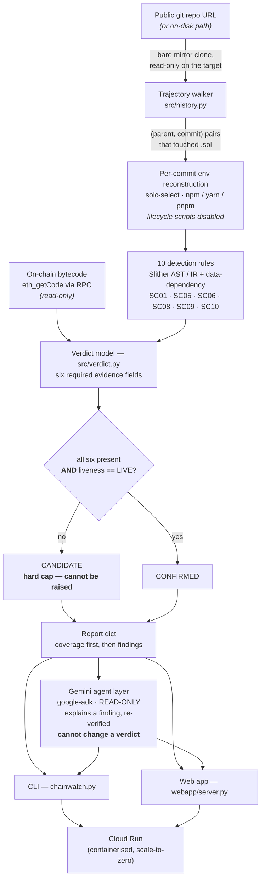

# Chainwatch

> Every other tool reports whether a contract is vulnerable **now**.
> Chainwatch reports **which commit made it vulnerable, and whether that commit
> is live on-chain.**

Chainwatch walks a Solidity repository's git history, runs ten deterministic
regression rules over every (parent, commit) pair, and reports the exact commit
where a security control was weakened or removed — with the contract, the
function, the line range, the author, whether the regression is still present at
HEAD, and (given an address) whether that code is what is deployed.

It detects **regressions**, not novel bugs: a control that existed and no longer
does. A contract that was never safe is out of scope by design — see
[CHARTER.md](CHARTER.md).

---

## Architecture



Full architecture — all three engines, the 13-gate evidence chain, the agent
roles and what each may decide, and where Gemini connects to the backend, the
database and the frontend — is in **[docs/architecture.md](docs/architecture.md)**.

**The `CANDIDATE → CONFIRMED` boundary is the one hard constraint in the system.**
A verdict reaches CONFIRMED only when all six evidence fields are present *and*
on-chain liveness is `LIVE`; missing any of them caps it at CANDIDATE, and
**nothing downstream can lift that cap** — not complete evidence, and above all
not the Gemini agent, which may only read a finished finding record and is
re-verified mechanically against it. The agent explains; it never decides.

---

## Try it yourself — a real, publicly disclosed $6.5M exploit

Reproducible end to end in about 30 seconds once dependencies are cached. Read
the "what you should see" block below before running it: the verdict this case
reaches today is CANDIDATE, and why it is not CONFIRMED is measured rather than
glossed.

**The case.** In February 2021, 88mph refactored `NFT.sol` to use EIP-1167
clones. Commit `a4c48d61` replaced a one-shot `constructor(name, symbol)` with
an external `init(address newOwner, string, string)` carrying **no access
control** — anyone could seize ownership of a deposit NFT. It was reported
responsibly through Immunefi, fixed six weeks later, and
[publicly written up](https://medium.com/immunefi/88mph-function-initialization-bug-fix-postmortem-c3a2282894d3).

Chainwatch is not "finding" this bug — a whitehat did, five years ago. It is
demonstrating that the tool **locates the introducing commit from history
alone**. Whether the pipeline can then reach the on-chain half for this
particular shape is measured, and stated, below.

```bash
# 1. Get the target repository at the vulnerable commit
git clone https://github.com/88mphapp/88mph-contracts realworld-test/88mph-src

# 2. Scan the one commit pair, with the real deployed address
python chainwatch.py   --repo realworld-test/88mph-src   --address 0xDe71B24FE56358cC0ADfd6f2e0f6D8ed9e2CF634   --pairs 5f52a2ead702e4cb9ab3d04a1109807462dde228:a4c48d61661ae3d8ce5aadfda6e4de27c4f07a9e   --check-exploit-proof
```

Or start the web UI and paste the same three values into the form:

```bash
python webapp/server.py          # then open http://127.0.0.1:8000
```

**What you should see** (measured on 2026-08-30, unedited):

```
[1/1] 5f52a2ead702..a4c48d61661a  integrate EIP-1167 into NFT deployment
... installing dependencies for 5f52a2ead702..a4c48d61661a (npm)
    CANDIDATE rule 10  contracts/NFT.sol::NFT.init

#1  CANDIDATE   rule 10 - SC01 Control migrated to an unguarded entry point
    contracts/NFT.sol:39   NFT.init

    TRAJECTORY
      introduced : a4c48d61661a  2021-02-16  Zefram Lou
      parent     : 5f52a2ead702
      lines      : 36-49
      at HEAD    : repaired later (quiet at f4886f318d07)
      on-chain   : UNKNOWN - contract not present at HEAD, or it does not
                   compile to runtime bytecode
```

**Chainwatch locates the introducing commit from history alone** — the file,
the function, the exact lines, the author, the date, and the later commit that
repaired the source. That is the claim this case demonstrates, and it holds.

**The verdict stops at CANDIDATE, and the reason is a real limitation, not a
property of the case.** This section previously showed a CONFIRMED verdict
here. It no longer does, and rather than quietly delete the case, here is
exactly what was measured:

- The deployed bytecode at `0xDe71B24F…` **is** byte-identical to this commit's
  build. Measured directly: compile `contracts/NFT.sol` at `a4c48d6` with the
  Sourcify-recovered settings (`solc 0.5.17, optimizer on (200 runs), evm
  istanbul`) and `liveness.check_against_artifact` returns
  `LIVE — normalized runtime bytecode is identical to the compiled artifact`.
  The evidence is real.
- **The scan pipeline cannot reach that evidence for this shape.** Liveness
  compiles the finding's path at HEAD; at HEAD the file has *moved*
  (`contracts/NFT.sol` → `contracts/tokens/NFT.sol`), which reads as "not
  present" — and the immutable-code fallback that would compare against the
  regression commit instead is armed only when the address is an EIP-1167
  *clone*. `0xDe71B24F…` is the *implementation* those clones delegate to
  (`proxy_kind: none`, 8,500 bytes of code), so the fallback stays disarmed.

Both halves of that are recorded as **`LIVE-L1`** in
[LIMITATIONS.md](LIMITATIONS.md), with the measurement, rather than being
worked around. Widening the fallback from "is a clone" to "is not a proxy, so
its code cannot be updated" is the obvious fix and would restore CONFIRMED on
the same evidential bar — but it changes when CONFIRMED is reachable, so it
gets its own tests and its own measurement, not a rushed edit.

Two things are still worth noticing:

- **`build settings … solc 0.5.17, optimizer on (200 runs), evm istanbul`** —
  fetched from Sourcify, not guessed. Rebuilding with the wrong optimizer
  setting produces bytecode 56% larger than what is deployed, and liveness could
  then only ever answer `UNKNOWN`.
- **The funnel says exactly where this stopped** (`--funnel`): killed at
  `liveness_live`, blocked on `reachability`, `distance_to_confirmed: null` —
  no evidence a caller could supply moves it, which is a different and more
  useful statement than a bare CANDIDATE.
- **No funds are at risk.** 88mph moved everything to treasury within 24 hours
  of the 2021 disclosure; the implementation holds 0 ETH today. The source was
  fixed — but an EIP-1167 clone's implementation is immutable, so the deployed
  instances still run the vulnerable code. *"Fixed in source"* and *"fixed
  on-chain"* are different claims, and that gap is what this tool exists to
  surface.

### Would it have caught it at the time?

```bash
python backtest.py
```

Anchors to incidents this project did not author, at commits chosen by someone
else, with the answer already settled by a public post-mortem:

```
88mph-nft-init-2021  (2021-02-16)
  expect rule 10 on NFT.init
  -> CAUGHT   14.7s
```

Fixture precision says an implementation matches its own specification.
A backtest says the specification catches real attacks. See [BACKTEST.md](BACKTEST.md).

---

## Google Cloud and Gemini

**Gemini 3.5** (`gemini-3.5-flash-lite`) via **Google ADK**, running on
**Cloud Run** with **Firestore** — all three used for what they are actually
good at, and deliberately kept out of the trust path.

### What the Gemini agent does

It runs a real tool-using loop over a finished finding — read the evidence,
draft, self-verify, correct, save, then rank findings against each other:

```
get_finding → get_diff → draft_report → verify_report → verify_report
            → save_report → explain_impact → verify_impact
```

`verify_report` appearing **twice** in that trace is the system working: the
first draft violated the gate, the agent was told exactly which span failed, and
it corrected itself before saving.

### What it cannot do, structurally

- **It cannot change a verdict.** CONFIRMED/CANDIDATE is decided by
  `src/verdict.py` before the model sees anything. The agent is handed a
  finished record and eleven read-only tools (`agent/tools.py::ALL_TOOLS`).
- **It cannot invent a fact.** [`agent/verify.py`](agent/verify.py) is a
  *mechanical* gate, not a second model: every commit hash, address, source
  path, line reference and qualified name in the draft must already appear in
  the finding record, or the report is refused. Asking a model to grade a model
  gives you two things that can be wrong instead of one.
- **It never produces exploit material.** Enforced by the same gate.

So the model does the part it is genuinely better at — turning a machine record
into a disclosure a human can read and prioritise — while every claim a reader
could act on remains something deterministic code established.

### Google Cloud services

| Service | Role |
|---|---|
| **Cloud Run** | hosts the scanner and web UI; scale-to-zero, 2 vCPU / 4 GiB, 3600s timeout |
| **Cloud Run Jobs + Cloud Scheduler** | the unattended sweep (capability 21) — a batch that ends, on a schedule, with nobody watching. Recipe in [deploy/sweep-job.md](deploy/sweep-job.md) |
| **Firestore** | findings corpus + job state, keyed by `(repo, prev_sha, cur_sha)` — so a pair is never re-analysed, and cross-repository queries become possible. Collections: `scans`, `pairs`, `findings`, `funnel_traces`, `agent_runs`, `agent_turns`, `sweeps` |
| **Secret Manager** | `GEMINI_API_KEY`, never in the image or the repo |

Firestore is optional at runtime: with no cloud project configured,
[`src/corpus.py`](src/corpus.py) degrades to *"not recorded"* and the analysis
engine runs unchanged on a laptop.

---

## Run it

```bash
python webapp/server.py            # UI on http://127.0.0.1:8000
```

```bash
python chainwatch.py --repo <path-or-url> --root contracts --limit 30
```

```bash
python chainwatch.py --repo <path> --address 0xYourProxy --json report.json
python chainwatch.py --from-json report.json --generate-reports   # no re-scan
```

The web app is a thin shell over `src/scan.py` — the same engine the CLI uses,
so the two can never disagree about what a finding is. It binds to `127.0.0.1`
by default: starting a scan installs the target repo's dependencies (with
lifecycle scripts disabled) and reads its history, which is not an endpoint to
put on a network.

### Generating a dossier (capability 12)

```bash
python chainwatch.py --repo <path> --root contracts --generate-reports
```

or click **Generate report** on any finding in the web UI. The agent may only
read a finished finding record through the six report-path tools; it cannot
analyse, cannot
reach a chain or a repository's source, and cannot change a verdict. Every
document it produces is re-verified mechanically against the finding record
before it is written — a draft citing a commit hash, address, path or line that
is not in the record is refused, not corrected.

Needs `GEMINI_API_KEY` in `.env`. **The deterministic engine never needs one**;
a scan is complete and unaffected without it. The free tier allows 15 model
requests per minute and one dossier costs several, so the runner paces itself
and reports when it is waiting. Moving to a paid tier is a config change
(`--rpm`), not an architecture change.

### Environment variables

| Variable | Needed by | Notes |
|---|---|---|
| `GEMINI_API_KEY` | the agent layer only (capability 12) | The deterministic engine never reads it; a scan is complete without it. Injected at run time — never baked into the image. `GOOGLE_API_KEY` is accepted as an alias. |
| `PORT` | the container | Cloud Run sets this; defaults to `8080`. |
| `RPC_URL` (or `--rpc-url`) | on-chain liveness (capability 11) | A read-only Ethereum RPC endpoint. Optional; without it liveness is UNKNOWN. |

### Container (local)

```bash
docker build -t chainwatch .

# Web UI. Paste a public repo URL in the form; no mount needed.
docker run -p 8080:8080 -e GEMINI_API_KEY=... chainwatch
#   -> http://localhost:8080

# To scan a repository on your own disk instead of a URL, mount it read-only:
docker run -p 8080:8080 -e GEMINI_API_KEY=... -v /path/to/repo:/repos/target:ro chainwatch
```

The image carries the **whole product** — engine, scan pipeline, web app and
agent. Verified end to end inside the container: `scorer.py` passes a frozen
fixture set, a repository scans to attributed CANDIDATE findings, and the agent
drafts a verified dossier. The API key is never baked in — no `ARG`, no `ENV`,
`.env` is in `.dockerignore` — and this is checked: `docker history` contains no
key material and the image's `Config.Env` carries only `PATH`, `LANG`,
`PYTHON_*` and `PORT`.

### Live instance (Google Cloud Run)

**Deployed and serving:** <https://chainwatch-898260334135.us-central1.run.app>

`2 vCPU / 4 GiB`, request timeout `3600s`, `min/max` instances `0/2`
(scale-to-zero). `GEMINI_API_KEY` is supplied through **Secret Manager**
(`--set-secrets=GEMINI_API_KEY=chainwatch-gemini-key:latest`), never as a
plaintext value or an image layer. Deploy is reproducible from a clone:

```bash
gcloud run deploy chainwatch --source . --region us-central1 \
    --memory 4Gi --cpu 2 --timeout 3600 --concurrency 4 \
    --min-instances 0 --max-instances 2 --allow-unauthenticated \
    --set-secrets=GEMINI_API_KEY=chainwatch-gemini-key:latest
```

A live smoke test scanned `reserve-protocol/protocol` at pair `f43202a3..e27227b2`
to one CANDIDATE finding (Rule 5, `ActFacet.revenueOverview`) and generated a
verified "NOT CONFIRMED" dossier through the agent pipeline end to end.

### From source (no container)

```bash
pip install -r requirements.txt
solc-select install 0.8.20 && solc-select use 0.8.20
python webapp/server.py                                   # UI on http://127.0.0.1:8000
# or the CLI:
python chainwatch.py --repo <path-or-url> --root contracts --limit 30
```

---

## What it detects

| Rule | OWASP | Regression |
|---|---|---|
| 1 | SC01 | access-control constraint on `msg.sender` removed |
| 2a | SC08 | reentrancy mutex removed |
| 2b | SC08 | CEI ordering broken (state write moved across an external call) |
| 3a | SC10 | upgrade authorization weakened |
| 3b | SC10 | initializer became re-callable |
| 3c | SC10 | storage layout collision on a proxy-deployed contract |
| 4 | SC09 | overflow protection removed (`unchecked`, SafeMath, pragma lowered) |
| 5 | SC06 | external-call return value no longer checked |
| 6 | SC05 | input-validation `require` removed |
| 10 | SC01 | control migrated to a new unguarded entry point (a renamed or replacement function that re-exposes what a guarded one protected) |

Every rule is semantic — Slither AST/IR and data-dependency analysis. No regex
on source, no modifier **name** matching (name matching is the single largest
false-positive source in this class of tool).

---

## How to read a result

**Coverage comes before findings, always.** A scan that could only analyse 3 of
40 commit pairs reports zero findings, and so does a scan of a clean repository.
Both the CLI and the UI print the analysed/skipped ratio with a per-skip reason
above the findings, and say so explicitly when the history was not fully seen.
A quiet result over an unanalysed commit means *unmeasured*, not *safe*.

**Three verdicts** (`RULES.md`, implemented in `src/verdict.py`):

- **DISCARDED** — an exclusion matched. Never surfaced.
- **CANDIDATE** — the trigger fired and no exclusion matched, but at least one
  of the six required evidence fields is missing.
- **CONFIRMED** — all six present, and liveness is LIVE.

The six fields are: regression commit (hash/author/date/line range), pre-state,
post-state, reachability (externally callable, state-changing, **and still
present at HEAD**), no compensating control, and on-chain liveness.

One consequence is worth stating plainly, because it surprises people: **a
repo-only scan with no `--address` produces zero CONFIRMED findings.** Liveness
is one of the six. A regression in git that is not the code holding funds is a
CANDIDATE, and calling it more than that would be the exact overclaim this
project exists to avoid.

---

### The agentic layer — four roles, one decider (capabilities 20 and 21)

```bash
python chainwatch.py agent --repo <path-or-url>          # ADK orchestration
python chainwatch.py sweep --repos deploy/sweep-targets.txt   # unattended
```

`chainwatch agent` runs the deterministic scan first, then an ADK
orchestration over its finished output:

| Role | Kind | May propose | May decide |
|---|---|---|---|
| **Hunter** | Gemini 3.5 via ADK `LlmAgent` | which candidates deserve deeper evidence work, and each one's invariant | nothing |
| **Skeptic** | Gemini 3.5 via ADK `LlmAgent` | disproof challenges | nothing — a challenge is an *input* |
| **Reproducer** | Gemini 3.5 via ADK `LlmAgent` | a reproduction plan | nothing |
| **Gatekeeper** | **deterministic code** | — | **everything** |

Three constraints, each enforced by construction rather than by a prompt:

- **It cannot change a verdict.** The engine's verdicts are snapshotted before
  a single token is generated, recomputed after the last agent turn, and
  compared. A difference raises `VerdictDrift` and the run fails — on every
  invocation, not only under test.
- **The Hunter cannot create a finding.** A proposal naming an id the engine
  never produced is dropped, and the drop is printed.
- **The Reproducer never sees the write-up.** It receives a frozen
  `ReproducerBrief` of exactly four fields — contract, function, invariant,
  objective. Blinding is a property of the type, so there is no path that
  could leak the analyst's prose even by mistake.

The control experiment ships with it: `--agent-no-llm` abstains every model
turn and runs the same orchestration. It must produce identical verdicts, and
a test asserts that it does. On a real run the blinding is visible in the
model's own answer — asked to plan a reproduction, `gemini-3.5-flash-lite`
listed *"the exact function signature"* and *"the method used for access
control"* under `unknowns`, because it had not been told them.

`chainwatch sweep` is the path with no human in it: a list of repositories,
walked end to end, on a schedule (`deploy/sweep-job.md` — Cloud Run Job +
Cloud Scheduler). Its one non-negotiable property is that **a failing target
does not end the sweep** — every failure is recorded with its reason and
counted in `totals.failed`, beside `totals.ok`. A sweep over public repos has
no deployed addresses, so nothing it finds can reach CONFIRMED; its product is
the funnel — which candidates are one address away — not a CONFIRMED count.

---

### The funnel — where each candidate actually stopped (capability 19)

"0 CONFIRMED" is not one result, it is several, and a bare count cannot tell
them apart. Every candidate was disproved is the opposite situation from every
candidate died one gate short of a deployed address nobody supplied. The funnel
is that missing view, and every scan now carries one:

```bash
python chainwatch.py --repo <path> --funnel
python chainwatch.py --repo <path> --funnel --funnel-format csv > funnel.csv
```

```
FUNNEL (capability 19) - a derived view; it decides nothing
  1 candidate(s): CANDIDATE 1
  1 resolvable, 0 killed; median distance to CONFIRMED 2

  BLOCKED ON (a gate that has not been able to run)
      1  liveness
      1  liveness_live

  RESOLUTION QUEUE - closest to a decidable answer first
    1. [distance 2] 1-FeeManager-setFee-dac6083a  (CANDIDATE, rule 1)
       supply: address, rpc_url
       liveness (PENDING) needs: address, rpc_url
           re-run with --address <deployed address>; liveness is UNKNOWN
           until deployed bytecode is compared
```

Per candidate it records the state of every gate, the first gate that FAILED
(if any), the gates that are unresolved, `distance_to_confirmed`, and — for
each unresolved gate — the deterministic input that would let that gate
actually run. The **resolution queue** ranks candidates by that distance, then
by finding-type severity: it orders *work*, never truth.

Three constraints make this instrumentation rather than a second opinion:

- **`distance_to_confirmed` is a count of gates that have not run.** Not a
  score, not a probability, not a likelihood that a finding is real. Distance 1
  means exactly one mechanical check is outstanding.
- **Nothing here promotes anything.** Supplying a named input lets a gate run;
  the same verdict function then decides the outcome, unchanged.
- **Every trace is re-derived before it is shown.** `funnel.verify` recomputes
  the stored verdict from the stored gate states using the engine's own gate
  function, and any divergence is a hard error — in the CLI, in the API, and in
  the test suite:

```bash
python chainwatch.py --verify-funnel report.json    # exit 1 on any divergence
```

The classic six-field model and the next-gen 13-gate model are both traced, and
each trace says which rulebook produced it. That the funnel's restatement of
the six-field model returns exactly what `src/verdict.py` returns is not
asserted, it is proved: `tests/test_funnel.py` walks all 768 shapes a classic
finding can take and compares the two answers.

---

## Precision discipline

- `fixtures/` and its 13 sibling sets are frozen ground truth, hash-guarded by
  `./guard.sh check`. If a check fails, the logic gets fixed — never the test.
- `python scorer.py --fixtures <set>` enforces **precision = 1.00** (zero false
  positives) and recall ≥ 0.70 per shipped rule, on all 14 sets.
- `python scorer.py --empty-detector` proves the scorer can fail.
- `tests/test_attribution.py` proves every fire is attributable to a real
  declaration, and that a quiet rule emits nothing.
- `tests/test_realworld_reserve.py` re-measures the six false positives found
  on a real repository (reserve-protocol) — five must stay quiet, and the one
  that was never an FP must still fire. A fix that silences everything fails
  this test.
- `tests/test_agent_tools.py` proves the agent's hallucination gate by feeding
  it drafts that must be rejected: an invented commit hash, an invented address,
  an invented source path, an out-of-range line, an invented `Contract.function`,
  three overclaim phrasings, a stripped header, and exploit material. A gate that
  has never rejected anything is not known to work.
- `tests/test_verdict.py` pins the classifier, including that a rule's CANDIDATE
  ceiling can never be raised by complete evidence.

**Coverage is repo-dependent and reported as such.** On a modern window of
reserve-protocol every commit pair analysed; on a 25-pair walk into that same
repo's older history only **5 of 72 file comparisons completed (6.9%)**, because
57 of them pin exact compiler versions that were not installed. That number is
printed, not hidden — see `HIST-L2` in LIMITATIONS.md. A finding count is only
meaningful next to it.

Every rule's known blind spots are recorded per rule in
**[LIMITATIONS.md](LIMITATIONS.md)**. Two worth knowing before reading any
result:

- Rule 3c proves a contract was *written* to sit behind a proxy, not that it
  *does*. On-chain liveness is what closes that gap.
- Rules 3b and 3c cannot fire on ERC-7201 namespaced storage in the general
  case (the OpenZeppelin 5.x default). On such repos a quiet result from those
  two rules means *unmeasured*, not *safe*.

---

## What has and has not been demonstrated

The project's own charter set seven success criteria. Six are met. The seventh
is not, and it is recorded as a **scope finding rather than a checkbox** — the
full reasoning, including the five disclosed-incident candidates that were
searched and rejected with reasons, is in
**[SUBMISSION-NOTES.md](SUBMISSION-NOTES.md)**. The short version, unsoftened:

> **Criterion #6 as written is unsatisfiable within responsible-disclosure
> constraints.** CONFIRMED requires `liveness == LIVE`. A regression that is live
> on-chain and not yet fixed is an undisclosed vulnerability on a funded
> contract — not something to put in public material. Responsible targets are
> already patched, so their liveness is `PATCHED` and they cap at CANDIDATE. The
> only targets that could produce a public CONFIRMED are exactly the ones it
> would be irresponsible to publish.

The real-world demonstration is therefore Reserve Protocol's
`ActFacet.revenueOverview` at commit `e27227b2` — a real repo, a real commit, a
`try/catch` removed from a function that kept its name *and* signature, attributed
to lines 117-118. It caps at **CANDIDATE** because required evidence field 4 is
*"externally callable **and** state-changing"* and the function is a view. No rule
was changed and no exception written to reach that answer; it falls out of the
model.

The honest one-line claim, recorded so public material has something to match:

> Chainwatch located the exact commit that removed a control in a real public
> protocol, attributed it to the function and line, and then **declined to call
> it CONFIRMED** because one of its six required evidence fields was not
> established.

Not *"Chainwatch found a confirmed vulnerability."* It did not, and the
distinction is the product.

Separately, capability 11 **is** proven on real mainnet data: the vulnerable
88mph NFT implementation behind three EIP-1167 clones returns **LIVE**, with
normalized runtime bytecode matching the compiled artifact exactly, and the
paired no-optimizer control returns UNKNOWN rather than guessing PATCHED. Every
surface that shows a LIVE verdict shows this with it:

> LIVE = this exact bytecode is present on-chain at this address and is what
> executes there. It does NOT mean the contract is currently reachable, funded,
> or exploitable — liveness compares code, not risk.

---

## Pre-existing work disclosure

The All Things Agentic Hackathon submission period ran **3 Aug 2026 → 31 Aug
2026**, and the rules require that projects be newly created within it while
disclosing any pre-existing code incorporated. Chainwatch's first commit is
dated **1 Aug 2026** — two days early. That is stated here in full rather than
rounded off, because a tool whose entire argument is "state what you measured,
including the parts that are inconvenient" does not get to make an exception
for its own submission.

**What existed before 3 Aug 2026** — 28 commits, ending at `21aa72f`, totalling
**16 Python files / 2,431 lines**:

| Component | State on 2 Aug |
|---|---|
| `CHARTER.md`, `RULES.md`, `LIMITATIONS.md` | written |
| Detection rules 1, 2a, 2b, 3a, 3b, 3c, 6 | written, fixture-scored |
| `src/history.py`, `src/liveness.py`, `src/verdict.py` | written |
| Fixture corpus + `scorer.py` + `guard.sh` integrity guard | written |

**What did not exist at all before 3 Aug 2026:**

`src/scan.py` (the scan pipeline) · `chainwatch.py` (the CLI) · `webapp/` (the
web app) · `agent/` (the ADK agent layer) · `tests/` (the entire test suite —
there was no `tests/` directory) · rules 4, 5, 10, 11, 12 · `src/corpus.py`
(Firestore) · the Cloud Run deployment · `src/nextgen/` (the 13-gate evidence
model, the Skeptic, the blinded Reproducer, the Counterfactual Twin, the Deep
Hunt engine) · `src/funnel.py` (the funnel and resolution queue) ·
`agent/orchestrator.py` (the ADK multi-agent layer) · `src/sweep.py` (the
unattended sweep) · every benchmark harness and every number in
`BENCHMARK.md`.

**Proportion, measured rather than characterised:** 2,431 of the current 43,641
tracked Python lines predate the window — **94.4% of the code in this
repository was written during the submission period**, along with all of its
tests, its cloud deployment, and every agentic component.

**How to check this yourself**, rather than taking the table on trust:

```bash
git log --reverse --format="%h %ad %s" --date=short --until=2026-08-03
git ls-tree -r --name-only 21aa72f | grep -E "^(src|tests|agent|webapp)/"
```

The submitted project is the system as it stands — the ADK agent layer, the
evidence-gate model, the funnel, the benchmarks and the deployment, all built
inside the window — incorporating that 2,431-line detection core as disclosed
prior work.

---

## Scope

Chainwatch does **not** fuzz, symbolically execute, or formally verify; does not
detect novel vulnerabilities; does not generate exploit code or proof-of-concept
transactions; and never auto-discloses anything.

On chain it is strictly read-only — `eth_getCode`, `eth_getStorageAt` and
read-only `eth_call`, with no code path that can send a transaction.

On a target repository it is **read-only, literally**. Chainwatch makes a bare
clone inside its own scratch directory first, and every worktree, checkout and
piece of git bookkeeping happens in that clone — so the repository you point it
at is only ever the source of a clone and a fetch. Verified against a read-only
bind mount: the scan completes normally and `.git/worktrees/` in the target
stays **absent**, not merely unchanged.

This was not always true: `git worktree add` used to run against the target
directly, which writes metadata into its `.git`. That gap, its measurement and
its fix are recorded in LIMITATIONS.md under `WALK-L6` rather than quietly
corrected.

## License

Chainwatch is licensed under AGPL-3.0 — see [LICENSE](LICENSE). This project
uses Slither, crytic-compile, and solc-select, all AGPL-3.0. Attribution and
the full third-party component list are in [NOTICE](NOTICE).
