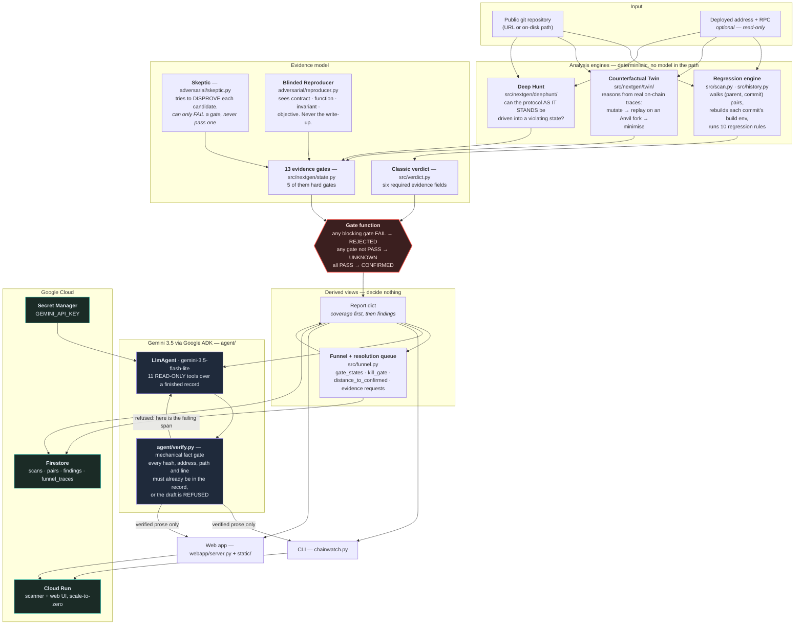
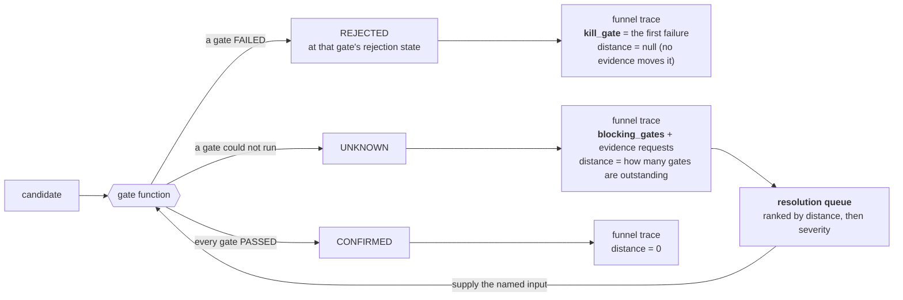

# Chainwatch — architecture

One question runs through every box in this document: **who is allowed to
decide that something is a finding?** The answer is always the same — a
deterministic gate function, never a model. Everything else follows from that.

- The engines **propose**.
- The gates **decide**.
- The Gemini/ADK layer **explains what was already decided**, and is
  mechanically re-checked against the record before a word of it is written.

---

## 1. The whole system

**Read the red box first.** `VF` is the only thing in the diagram that can
produce a verdict. Nothing enters it except gate states set by deterministic
analysis, and nothing downstream of it can change what it said.

---

## 2. The agent roles, and what each one is allowed to do

| Role | Implementation | May propose | May decide | Sees the hunter's write-up |
|---|---|---|---|---|
| Hunter | rules + engines (`src/rules/`, `src/nextgen/`) | ✅ candidates | ❌ | n/a |
| Skeptic | `src/nextgen/adversarial/skeptic.py` | ✅ challenges | **FAIL only** | yes |
| Reproducer | `src/nextgen/adversarial/reproducer.py` | ✅ a reproduction | ❌ | **no — blinded by construction** |
| Gatekeeper | `src/nextgen/state.classify` | ❌ | ✅ **the only decider** | n/a |
| Reporter | `agent/` (Gemini via ADK) | ✅ prose | ❌ | yes, after the verdict exists |

Two of those rows are load-bearing and are tested rather than asserted:

- **The Skeptic can only fail a gate.** `gates.apply_skeptic` sets `FAIL` on a
  disproved challenge and `independent_validation` to PASS only when the sweep
  is clean over ≥ 3 checks **and** the blinded reproducer already agrees. There
  is no code path by which the Skeptic passes a gate on its own.
- **The Reproducer is blinded by construction, not by convention.** Its inputs
  are contract, function, invariant statement and objective — four fields. The
  write-up is not passed in, so there is nothing to leak.

---

## 3. The evidence chain (13 gates)

In evidence order. A `FAIL` maps to a specific rejection state; anything that
is not `PASS` leaves the finding at `UNKNOWN`, which is a first-class answer,
not a failure to answer.

| # | Gate | FAIL → | What supplies it |
|---|---|---|---|
| 1 | `regression_commit` | INSUFFICIENT_EVIDENCE | property timeline over git history |
| 2 | `build_environment` | INSUFFICIENT_EVIDENCE | per-commit dependency reconstruction |
| 3 | `security_invariant` | INSUFFICIENT_EVIDENCE | validated-invariant set diff |
| 4 | `reachable_path` | UNREACHABLE | attack-path search from an unprivileged EOA |
| 5 | `state_reachable` | UNREACHABLE | execution on a fork |
| 6 | `no_compensating_control` | FALSE_POSITIVE | compensating-control sweep |
| 7 | `invariant_violated` | FALSE_POSITIVE | observed during reproduction |
| 8 | `reproducer` | INSUFFICIENT_EVIDENCE | blinded Foundry reproduction |
| 9 | `bytecode_provenance` | DEPLOYMENT_MISMATCH | normalised runtime-bytecode comparison |
| 10 | `target_live` | PATCHED | deployed implementation read |
| 11 | `independent_validation` | FALSE_POSITIVE | Skeptic sweep + reproducer agreement |
| 12 | `not_duplicate` | DUPLICATE | findings corpus |
| 13 | `economically_feasible` | ECONOMICALLY_INFEASIBLE | value-at-risk inputs (`na_is_pass`) |

The five **hard gates** — reproducer, reachable attack path, deployment match,
no compensating control, independent validation — block CONFIRMED outright.

`SKIPPED` counts as `PASS` only where a gate's own spec says so (gate 13
alone). Everywhere else "could not check this" resolves to UNKNOWN, never to
CONFIRMED. That is the same discipline as the classic charter's decisive gate:
**a source-only scan with no address produces zero CONFIRMED findings, by
construction.**

---

## 4. What happens to a candidate that does not reach CONFIRMED

The loop back into the gate function is the point: the queue tells a human
exactly which deterministic input is missing, that input is supplied, the gate
runs, and **the same gate function** decides again. No step in that cycle
raises a verdict on its own — which is why `funnel.verify` recomputes every
stored verdict from its own stored gate states and treats any divergence as a
hard error.

---

## 5. Google Cloud, concretely

| Service | Role | Where in the code |
|---|---|---|
| **Cloud Run** | hosts scanner + web UI; 2 vCPU / 4 GiB, 3600s timeout, min/max instances 0/2 | `Dockerfile`, `webapp/server.py` |
| **Cloud Run Jobs + Cloud Scheduler** | the unattended sweep: a batch that ends, on a schedule, with no human present | `src/sweep.py`, `deploy/sweep-job.md` |
| **Firestore** | `scans`, `pairs`, `findings`, `funnel_traces`, `agent_runs`, `agent_turns`, `sweeps` — so a commit pair is never re-analysed, "where do candidates die" is answerable across every scan ever run, and what each agent saw and said is a queryable record rather than a claim | `src/corpus.py` |
| **Secret Manager** | `GEMINI_API_KEY`, injected at run time, never in an image layer | deploy flags in `README.md` |
| **Gemini 3.5 (`gemini-3.5-flash-lite`) via Google ADK** | the reporting agent's tool-using loop, rate-paced through ADK's `before_model_callback` | `agent/runner.py` |

Firestore is **optional at runtime**: with no cloud project configured,
`src/corpus.py` degrades to "not recorded" and the analysis engine runs
unchanged on a laptop. A scan whose persistence fails is still a valid scan.

---

## 6. Where to look in the code

| Question | File |
|---|---|
| What does a scan actually do? | `src/scan.py` |
| What decides CONFIRMED (classic)? | `src/verdict.py` → `classify` |
| What decides CONFIRMED (next-gen)? | `src/nextgen/state.py` → `classify` |
| How is a gate set from an analysis? | `src/nextgen/gates.py` |
| Where did each candidate stop? | `src/funnel.py` |
| What may the model see and say? | `agent/tools.py`, `agent/verify.py` |
| What is deliberately not implemented? | `LIMITATIONS.md` |
| What was measured, and against what? | `BENCHMARK.md` |
